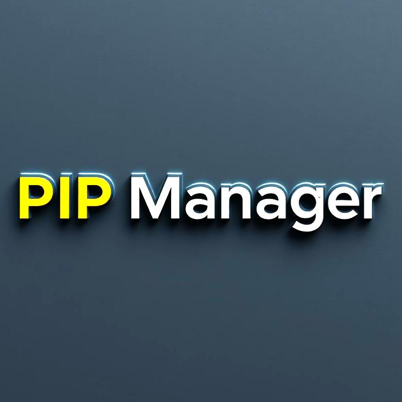
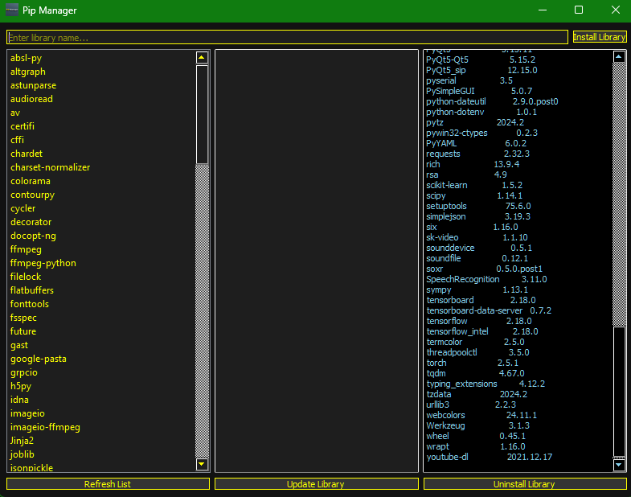

# Pip Manager
Developed by Ivan Ayub

Pip Manager is a versatile desktop application designed to streamline the management of Python libraries. With its intuitive interface, users can easily install, update, and remove libraries, as well as view detailed information about installed packages.

---

## Download
[Click here to download the EXE application from Google Drive (.zip)](https://example.com/download-link)

For inquiries or feedback, contact me at: [sellocasadenubes@gmail.com](sellocasadenubes@gmail.com).

---

## Description
Pip Manager simplifies Python library management by providing a graphical interface for pip commands. It is ideal for developers and Python enthusiasts who want a user-friendly tool for managing their programming environment.

---

## Features
- **Library Management:**
  - Install Python libraries effortlessly.
  - Update existing libraries to their latest versions.
  - Remove libraries no longer needed.

- **Library Information:**
  - View a list of installed libraries with version details.
  - Search for specific libraries.
  - Display library documentation and dependencies.

- **Modern Interface:**
  - Responsive design with a dark theme for ease of use.
  - Intuitive navigation for quick access to all features.

---

## How to Use
1. **View Installed Libraries:** Open the application to see a list of all installed libraries.
2. **Install a Library:**
   - Type the library name in the search bar.
   - Click "Install" to add the library to your environment.
3. **Update a Library:**
   - Select the library from the list.
   - Click "Update" to fetch the latest version.
4. **Remove a Library:**
   - Select the library from the list.
   - Click "Remove" to uninstall it.
5. **Search for Libraries:**
   - Use the search bar to find specific libraries.
   - Access detailed information about each library.

### Example Scenario
Easily install popular Python libraries like NumPy, Pandas, or Flask, and keep them up to date without needing command-line knowledge.

---

## Application Structure
### User Interface (UI)
Built with Tkinter, the application offers a modern and efficient interface for library management.

### Core Modules
1. **Pip Integration:** Directly interfaces with pip for all library management tasks.
2. **Logging System:** Displays real-time logs of pip commands executed.
3. **Search Functionality:** Enables users to quickly find and install new libraries.

---

## System Requirements
- **Operating System:** Windows 7 or later
- **Dependencies:**
  - Python 3.7 or later
  - Pip (pre-installed with Python)
  - Tkinter (bundled with Python)

---

## Captures

---

## Development & Contribution
### Credits
Pip Manager relies on Python’s built-in pip tool for library management. Special thanks to the Python Software Foundation for maintaining pip and the Python programming language.

This application also uses the following Python libraries:

- **os**: Standard library for interacting with the operating system.
- **sys**: Provides access to system-specific parameters and functions.
- **subprocess**: Executes pip commands from within the program.
- **tkinter**: Used for building the graphical interface.
- **logging**: Records detailed logs of operations.

### Contributions
We welcome contributions! To contribute:
1. Fork the repository.
2. Make your changes.
3. Submit a pull request.

---

Enjoy using Pip Manager! Your feedback is invaluable and helps us improve continuously.

